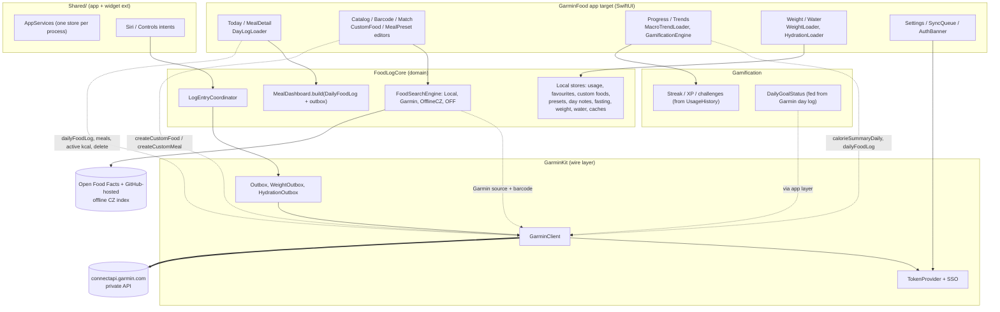

# Garmin dependency map

How much of GarminFood depends on the owner's Garmin Connect account, and
what a person without a Garmin account gets from the app today. Written
2026-09-24 against `origin/main` @ `b117adf`, by reading code. Nothing was run
on a device and no Garmin route was called. The plan that follows from this map
is [`openspec/changes/add-standalone-mode/`](../openspec/changes/add-standalone-mode/).

## Verdict

**No, the app can't be used without Garmin today. The app itself opens, but
logging food, its main job, does not work.** No sign-in gate exists.
`ContentView` goes straight into the Today, Progress and Profile tabs. Every
tab shows a "Not connected to Garmin" banner
(`AuthBannerView`), which says "Entries still save locally and will sync once
you reconnect". Water, weigh-ins, day notes, fasting, reminders and the
diagnostics log all work locally. Weigh-ins and drinks stay "not delivered"
forever. They pile up in the sync queue behind a sign-in banner that never
goes away.

Food logging fails because the app has only one logging path, and it ends in
a **Garmin `foodId`**:

- A Garmin search result carries a Garmin `foodId`, but getting one needs a
  signed-in search.
- An Open Food Facts or offline-Czech-index result is sent through
  `MatchConfirmationView`. That view searches Garmin again for a match or
  creates the food in Garmin, and both need sign-in.
- A custom food can't be saved until a "closest Garmin food" is picked
  (`CustomFoodEditorView`, `CustomFoodDraft.backingFoodId`).
- A barcode that isn't in Garmin falls back to the offline index (and then
  to the Garmin match flow) or to the custom-food editor.
- Quick picks, favourites, meal presets and "Log again" can only replay
  foods that already went through one of these paths.

For a new user, then, no food can be logged at all. Suppose some entries did
get into the outbox. The Today screen would still show them as "syncing"
rows and count their calories. But there would be **no calorie or macro
target**, because goals come only from Garmin's `dailyNutritionGoals`. The
Trends macro charts would be empty, and goal-based gamification would never
fire.

The domain layer is well factored for adding a second backend. The work is a
**new local system of record for food logs, local goals, and a mode
switch**. No rewrite is needed.

## Dependency classes

| Class | Meaning | Members |
|---|---|---|
| **(1) System of record (writes)** | Garmin holds the data; the app only queues it | Food log create/delete/edit-as-replace (`Outbox` → `PUT /nutrition-service/food/logs`, `DELETE /food/logs/{date}`), weigh-in add/delete (`WeightOutbox` → `POST /weight-service/user-weight`, `DELETE …/byversion/{samplePk}`), water add/negative correction (`HydrationOutbox` → `PUT /usersummary-service/usersummary/hydration/log`), custom food create (`PUT /nutrition-service/customFood`), custom meal create (`POST /nutrition-service/customMeal`) |
| **(2) Read with a local equivalent already** | A local copy or fallback already exists | Weigh-in history (`WeightStore`, merged by `WeightHistoryMerge`), water total (`HydrationStore`/outbox, `HydrationDayTotal`), water goal (local override, else 2000 ml), weight goal and start weight (local overrides `weightGoalOverrideKg`/start override), meal windows (`MealTypeDefaulting` clock fallback when `useGarminMealWindows` is off or no windows exist), food search (`LocalFoodSource`, `OfflineCzechIndexSource`, `OpenFoodFactsSource`, but see class 3: their results aren't *loggable* without Garmin), pending entries on the dashboard (outbox + `FoodCacheStore`) |
| **(3) Read with NO local equivalent** | Garmin is the only source | **The food log itself** (`GET /nutrition-service/food/logs/{date}`: synced entries, day/meal totals), **calorie and macro targets** (`dailyNutritionGoals`/`mealNutritionGoals` and `nutritionSettings`; the app has no goal editor), **Garmin food identity** (`foodId`/`servingId`, which every loggable path needs; see Verdict), macro trends (`GET /nutrition-service/calorie/summary/daily`), active kcal (`GET /usersummary-service/usersummary/daily`), activities (planned, `GET /activitylist-service/…`), barcode lookup in Garmin's DB (`/food/search/barCode`), meal windows (`GET /nutrition-service/meals/{date}`), profile name/photo (`/userprofile-service/socialProfile`), region/language codes stamped on writes |
| **(4) Identity / auth only** | Credentials and connection state | `TokenProvider` (Keychain OAuth1/OAuth2), `GarminAuthSession`/`GarminSSOWebView` (in-app SSO sign-in, ticket paste fallback), `GarminAuthState` + `AuthBannerView` (loud banner), `OAuth1Signer`, Settings → "Garmin account" (sign in/out) |

## Layers and where Garmin sits

Dotted edges are the Garmin reads and writes a standalone mode has to replace
or turn off. Everything under "Local stores" and "Streak / XP" is already
Garmin-free.

## Feature by feature

Status means **"with no Garmin account, on a fresh install, today"**:
**Works**, **Degraded** (usable, but with nags, missing numbers or
permanently pending state), **Broken** (the feature's main action can't
complete), or **Blocked by sign-in** (the UI refuses outright).

| Feature / flow | Garmin reads | Garmin writes | Status without Garmin | Class | Files / types |
|---|---|---|---|---|---|
| **Onboarding / sign-in** | SSO ticket → OAuth1 → OAuth2 exchange | – | **Works, but no gate or onboarding.** The app opens straight into the tabs. A "Not connected to Garmin" banner shows on every tab and can't be dismissed. | 4 | `ContentView.withStatusBanners`, `AuthBannerView`, `GarminSSOWebView`, `GarminKit/TokenProvider.swift`, `GarminAuthSession.swift`, `AuthState.swift` |
| **Food search** | `/food/search` (Garmin source) | – | **Degraded.** Local, offline-Czech and OFF results appear, and the Garmin source shows "signed out". Only `.local`/`.garmin` origins are directly loggable (`SearchOrigin.isDirectlyLoggable`). | 2+3 | `FoodSearchEngine.standard`, `GarminSearchSource`, `LocalFoodSource`, `OfflineCzechIndexSource`, `OpenFoodFactsSource`, `Catalog/FoodCatalogView.swift`, `SearchResultsSection.swift` |
| **OFF / Czech result → log** | Garmin re-search for a match | `createCustomFood` (explicit tap) | **Broken.** `MatchConfirmationView` needs a Garmin match or a Garmin create before it reaches `LogEntryConfirmView`. | 3 | `Catalog/MatchConfirmationView.swift`, `FoodLogCore/GarminFoodMatching.swift` |
| **Barcode** | `/food/search/barCode` | – | **Broken for logging.** The Garmin lookup throws, and a hit in the offline index goes to the (broken) match flow. A miss opens the custom-food editor (broken). There is no online OFF barcode lookup. | 3 | `FoodLogCore/BarcodeResolution.swift`, `Catalog/BarcodeScanScreen.swift`, `BarcodeScanner.swift` |
| **Log / confirm** | – | Outbox → `PUT /food/logs` | **Broken in practice.** The confirm itself is purely local and would work, but no food can reach it (see Verdict). Anything queued stays `.pending` forever: `Outbox.drain` stops at `notSignedIn` without spending attempts. | 1 | `FoodLogCore/LogEntryCoordinator.swift`, `LogEntry/LogEntryConfirmView.swift`, `GarminKit/Outbox.swift` |
| **Today dashboard numbers and ring** | `GET /food/logs/{date}`, `GET /meals/{date}` | – | **Degraded, nearly empty.** `MealDashboard.build` would show queued entries as "syncing" and add their calories. It shows **no Target, ring or macro goals** (goals come only from `dailyNutritionGoals`). The meal order is the default one. | 3 | `Today/DayLogLoader.swift`, `Today/TodayView.swift`, `FoodLogCore/MealDashboard.swift`, `TodaySummary.swift`, `CalorieBand.swift` |
| **"Active today" line** | `GET /usersummary/daily` (`activeKilocalories`) | – | **Hidden.** The read fails and the line hides by design. | 3 | `DayLogLoader.loadActiveCalories` |
| **Meal detail** | the day log (per-meal goals and micros) | – | **Degraded.** Queued rows only, with no per-meal goals. | 3 | `Today/MealDetailView.swift` |
| **Edit / delete entry** | re-read of the day log | replace = create then `DELETE /food/logs/{date}` | **Degraded.** A queued entry can be swapped or cancelled locally. A "synced" entry can't exist. | 1 | `Today/EntryEditing.swift`, `DayLogLoader.delete`, `LogEntryCoordinator.edit/deletePending`, `LogEntryEditing.swift` |
| **Duplicate / copy meal** | `dailyFoodLog` of the source day (copy) | Outbox | **Broken.** Copy reads Garmin's log for the source day (`AppEnvironment.copyMealPlan`), and duplicate only queues. | 1+3 | `AppEnvironment.copyMealPlan/copyMeal/duplicateEntry`, `CopyMealPlanner` (FoodLogCore) |
| **Custom foods** | Garmin search for the backing food | (none, beyond the log) | **Blocked** by a required Garmin "closest match" (`backingFoodId`). | 3 | `CustomFood/CustomFoodEditorView.swift`, `FoodLogCore/CustomFood.swift` |
| **Meal presets** | – | optional `createCustomMeal` ("Sync to Garmin") | **Broken.** The store is local, but every ingredient must be a Garmin or custom food, so none can be added. | 1+3 | `MealPreset/*`, `FoodLogCore/MealPreset.swift`, `LogEntryCoordinator.confirmMealPreset` |
| **Quick pick / shelves / favourites / "Log again"** | – | Outbox | **Works, but empty.** They rank local `UsageHistory` and favourites, and there's nothing to rank. | 2 | `Catalog/QuickPickShelf.swift`, `FavoritesShelf.swift`, `FoodShelf.swift`, `FoodLogCore/UsageHistory.swift`, `RecentRanker.swift`, `MealUsualRanker.swift` |
| **Weight** | weigh-in range/dayview, nutrition settings (goal) | `WeightOutbox` add/delete | **Degraded.** Weigh-ins are committed locally and listed as not-yet-in-Garmin rows forever. The goal, start weight and ETA work from the local overrides. | 1+2 | `Weight/*`, `FoodLogCore/WeightTracking.swift`, `WeightLogCoordinator.swift`, `WeightHistoryMerge.swift`, `WeightGoalProgress.swift`, `GarminKit/WeightSync.swift` |
| **Water** | `GET /hydration/daily/{date}` | `HydrationOutbox` | **Degraded.** The total is the sum of local drinks (from the outbox). The goal is the override or 2000 ml. Every drink sits in the sync queue. | 1+2 | `Hydration/*`, `FoodLogCore/HydrationTracking.swift`, `HydrationLogCoordinator.swift`, `HydrationDayTotal.swift`, `GarminKit/HydrationSync.swift` |
| **Goals and targets** | `nutritionSettings`, `dailyNutritionGoals` | – | **Broken for kcal/macros**: shown read-only as "Set in Garmin Connect" and empty. Water and weight goals can be overridden locally. | 3 / 2 | `Profile/SettingsView.swift` (Nutrition plan), `Profile/GoalsSettingsSection.swift`, `App/AppPreferences+Goals.swift`, `App/ProfileLoader.swift`, `GarminHealthSync`/`GarminHealthCache` |
| **Fasting** | (history also reads cached Garmin day logs) | – | **Works.** Local schedule and reminders. History judges fasts from `UsageHistory` plus any cached Garmin logs. | – | `Fasting/*`, `FoodLogCore/FastingSchedule.swift`, `FastingLogMoments.swift` |
| **Day notes** | – | – | **Works.** Purely local. | – | `Today/DayNoteCard.swift`, `FoodLogCore/DayNote.swift` |
| **Trends** | `calorieSummaryDaily` (30 days) | – | **Broken for the macro charts.** The water streak/trend and day-note markers work. | 3 | `Trends/MacroTrendLoader.swift`, `TrendsView.swift` |
| **Gamification (existing)** | `dailyFoodLog` for `DailyGoalStatus` | – | **Degraded.** Streak, XP, levels, daily and long challenges from `UsageHistory` work. Goal-met challenges and achievements, and lifetime goal stats, **never fire**. | 3 | `App/GamificationEngine.refreshGoalStatus`, `Gamification/GoalStatus.swift`, `ChallengeEngine`, `DailyChallengeEngine`, `LifetimeStatsStore` |
| **Gamification (planned, 8 changes)** | Garmin day-log digest, active kcal, `activitylist-service` activities | – | Designed with `SignalAvailability`/`DataRequirement` gating, so tasks whose data is missing become ineligible. **Garmin-only:** sport and activity badges (`add-sport-and-body-achievements`: Fuel & Recover, race-day fuelling, …), bingo `m-refuel`/`h-earned-it`, challenges `sig-fuel-and-recover`/`sig-active-on-target`, the active-kcal → km journey and the `active-kcal-day` record (`add-journeys-and-records`). **Local-capable:** FoodTagger, collections, seasonal events, secrets, bingo food squares, boss (goal bosses need *local* goal status), weight milestones, fasting streak. | 3 | `openspec/changes/add-gamification-signals` (D-digest, `DaySignals.availability`), `add-sport-and-body-achievements`, `add-journeys-and-records`, `add-weekly-bingo`, `add-weekly-boss-and-streak-freezes` |
| **Notifications** | – | – | **Works.** Meal/streak/challenge/fasting reminders are local, and "meal logged" reads the dashboard sections. | – | `App/NotificationScheduler.swift`, `NotificationPreferencesStore.swift`, `FoodLogCore/NotificationPlanning.swift` |
| **Siri "log X"** | Garmin search (`origins: [.local, .garmin]`) | Outbox + `briefDelivery` | **Broken.** It replies "sign in again". | 3 | `Shortcuts/LogNamedFoodIntent.swift`, `GarminFoodShortcuts.swift` |
| **Quick-pick Controls / top quick-pick intent** | – | Outbox + `briefDelivery` | **Broken in practice.** There's nothing to pick, and a pick would throw `savedButSignedOut`. | 1 | `Shared/QuickPickLoggingIntents.swift`, `Shortcuts/LogTopQuickPickIntent.swift`, `GarminFoodWidget/Controls/*` |
| **Widgets** | – | – | **Works.** Static "open the app" surfaces, with no data (no App Group). | – | `GarminFoodWidget/*.swift` |
| **Background refresh** | reconcile read | drains all three outboxes | **Harmless no-op.** It is scheduled only while something is undelivered, so it keeps being scheduled forever. | 1 | `App/BackgroundRefresh.swift` |
| **Sync queue** | – | retry/cancel | **Degraded.** It lists every drink and weigh-in (and any food) as undelivered, forever. | 1 | `Profile/SyncQueueView.swift`, `AppEnvironment.refreshQueueState` |
| **Diagnostics** | – | – | **Works.** It logs auth failures on every foreground drain. | – | `GarminKit/DiagnosticsLog.swift`, `Profile/DiagnosticsLogView.swift` |
| **Offline Czech index** | – | – | **Works.** It downloads from this repo's GitHub release, not from Garmin. Its results aren't loggable (see OFF row). | 2 | `App/OfflineIndexLoader.swift`, `FoodLogCore/OfflineIndexStore.swift`, `OfflineFoodIndex.swift` |
| **Profile** | social profile (name, photo) | – | **Degraded.** Placeholder name. Local lifetime stats work. | 3 | `Profile/ProfileView.swift`, `App/ProfileLoader.swift` |
| **Usage-meal backfill** | `dailyFoodLog` × N days | – | **No-op.** It stops quietly on its first failure and retries on every foreground. | 3 | `AppEnvironment.backfillUsageMealsIfNeeded`, `FoodLogCore/UsageMealBackfill.swift` |

## Top findings

1. **The real blocker is identity, not sync.** Every loggable food ends in a
   Garmin `foodId`/`servingId`. Custom foods need a Garmin "backing food".
   OFF and Czech-index foods need a Garmin match or a Garmin create. So "just
   don't sync" is not enough. Standalone mode needs entries that carry their
   **own nutrient snapshot** and a food identity that isn't Garmin's.
2. **The food log itself lives only in Garmin.** Locally there is only the
   outbox (entries that aren't delivered yet, removed after reconciliation)
   and `UsageHistory` (capped at 500 events, with no nutrients). Neither can
   serve as a system of record. A new durable local day-log store is needed.
3. **Every calorie and macro target is Garmin's.** There is no local goal
   editor. The ring, meal targets, `DailyGoalStatus`, goal challenges and
   the Trends goal lines all read `dailyNutritionGoals`.
4. **Most consumers read one Garmin type, `DailyFoodLog`.** The dashboard,
   copy meal, goal status, fasting history and usage backfill all take it.
   That makes it a narrow seam: a local reader that produces the same shape
   keeps every one of those consumers unchanged.
5. **Weight, water, notes, fasting, streaks, XP and reminders are already
   local-first.** In standalone mode they only need to stop queueing Garmin
   deliveries and hide the "not in Garmin yet" state.
6. **No sign-in gate means no onboarding.** A non-Garmin user sees a
   permanent "Not connected to Garmin" banner and a sync queue that only
   grows. The app has no "I don't use Garmin" mode for the UI to key off.
7. **The planned gamification waves already gate on data availability**
   (`DaySignals.availability`, `DataRequirement`). Activity-based features
   are Garmin-only by nature and simply become ineligible. Goal-based ones
   need local goal status.
8. **HealthKit is not an alternative source.** `openspec/config.yaml` lists
   it as unavailable to the free Personal Team, alongside App Groups and
   iCloud. Only Keychain Sharing was actually device-tested; HealthKit was
   not. Standalone mode therefore has no source for active kcal or
   activities except manual entry.
